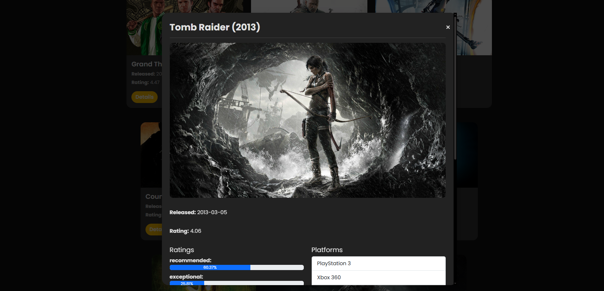
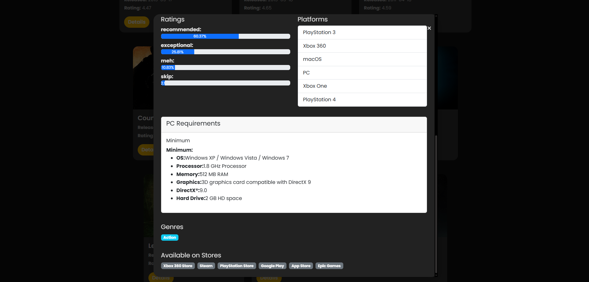

# 🎮 PlayPeek

**PlayPeek** is a sleek, responsive web app that shows game details using the RAWG Video Games Database API.  
Built with **React + TypeScript + Bootstrap + Vite** — no backend needed.

---

## 🚀 Features

- Browse a list of popular games
- View game name, release date, rating, and background image
- Responsive layout using Bootstrap
- Clean and type-safe React code with TypeScript
- Environment-based API key for secure access

---

## 📦 Tech Stack

- **Frontend:** React, TypeScript
- **Styling:** Bootstrap
- **Build Tool:** Vite
- **API:** [RAWG Video Games Database](https://rawg.io/apidocs)

---

## 🛠️ Setup

### 1. Clone the repo

```bash
git clone https://github.com/your-username/playpeek.git
cd playpeek
```

### 2. Install dependencies

```bash
yarn
```

### 3. Add `.env` file

Create a `.env` file in the root:

```env
VITE_RAWG_API_KEY=your_rawg_api_key_here
```

Get a free key from [RAWG.io](https://rawg.io/apidocs).

### 4. Start the dev server

```bash
yarn dev
```

---

## 📁 Folder Structure

```
src/
├── components/        # Reusable UI components (e.g., GameCard)
├── pages/             # Page-level components (e.g., Home)
├── services/          # API calls
├── types/             # TypeScript types/interfaces
├── App.tsx            # Root component
└── main.tsx           # Entry point
```

---

## 📷 Screenshots
Home Page

Game-Details-Modal



---

## 📌 License

MIT

---

## 🤘 Made with ❤️ by [Rajeev Hegde](https://github.com/rajeevhegde)
